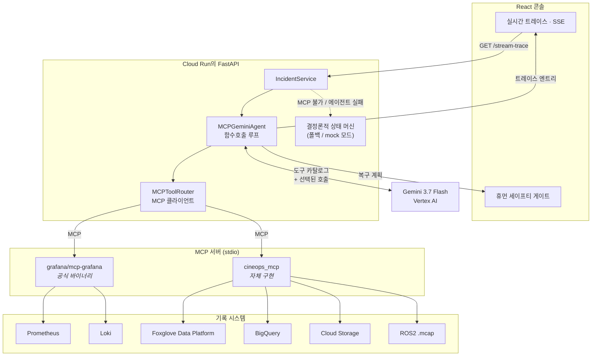

# CineOps Guardian

**가상 프로덕션 스테이지 사고를 진단하고 복구하는 MCP 네이티브 에이전트.**

[](https://cineops-guardian-1007800160926.asia-northeast3.run.app)
[](https://cloud.google.com/vertex-ai)
[](https://modelcontextprotocol.io)
[](LICENSE)

🌐 [English](README.md) · **[한국어](README.ko.md)** · [中文](README.zh.md)

---

## 문제

가상 프로덕션 LED 볼륨에서 로보틱 카메라 달리가 움직일 때, LiDAR와 옵티컬 트래커,
그리고 언리얼 엔진 프러스텀은 밀리미터 단위로 일치해야 합니다. 렌즈를 교체하고
정적 변환(static transform) 캘리브레이션을 다시 불러오지 않으면 LiDAR 포인트
클라우드가 광학 절점과 어긋납니다. 그러면 내비게이션 스택은 세트 바닥과 조명
스캐폴드를 유령 장애물로 인식해 회피 복구 루프에 빠지고, 카메라 프레임을 떨굽니다.

스테이지가 멈춥니다. 60명이 넘는 배우와 스태프가 **시간당 $25,000~$50,000**를
태우며 대기하는 동안, 엔지니어는 30분씩 ROS 로그를 grep하고 변환 트리를 뒤져
"누가 렌즈를 바꿨다"는 사실을 찾아냅니다.

## CineOps Guardian이 하는 일

그 조사를 **실제로 해당 시스템에 접근할 수 있는 에이전트**에게 넘기고, 에이전트가
자신의 작업 과정을 전부 드러내게 합니다.

Gemini 3.7 Flash에 도구 카탈로그를 주면, 무엇을 어떤 순서로 조회할지 **모델이
스스로 결정**합니다. Prometheus 메트릭과 Loki 로그를 끌어오고, 변환 드리프트를
추측하지 않고 ROS2 레코딩에서 직접 측정하고, 과거에 같은 방식으로 실패한 적이
있는지 조회하고, 리그 오퍼레이터가 실제 bag을 스크럽할 수 있도록 레코딩을
Foxglove에 게시합니다. 그런 다음에야 순위가 매겨진 진단과 복구 계획을 확정합니다.

그리고 멈춥니다. **에이전트에게는 로봇을 움직일 수 있는 도구가 없습니다.** 복구는
오퍼레이터의 서명을 기다리는 휴먼 세이프티 게이트에서 대기합니다.

### 스크립트가 아니라 에이전틱이라는 근거

조사 과정에 고정된 파이프라인은 없고, 트레이스가 그것을 증명합니다. 배포된
서비스에서 실제로 실행된 기록입니다.

| #     | 모델이 선택한 도구                                      | 서버    | 결과                                          |
| ----- | ------------------------------------------------------- | ------- | --------------------------------------------- |
| 1     | `mcp_initialize`                                        | —       | MCP 서버 2개, 도구 11개                       |
| 2     | `list_datasources`                                      | grafana | `grafanacloud-prom`, `grafanacloud-logs` 발견 |
| 3     | `inspect_mcap_recording`                                | cineops | 메시지 120개, TF 드리프트 측정                |
| 4     | `search_incident_history`                               | cineops | BigQuery: 과거 테이크가 동일하게 실패         |
| 5–8   | `list_prometheus_metric_names`, `list_loki_label_names` | grafana | 어떤 라벨이 있는지 탐색                       |
| 9     | `query_loki_logs`                                       | grafana | **HTTP 400 — LogQL 문법 오류**                |
| 10    | `query_loki_logs` (재시도)                              | grafana | 모델이 쿼리를 고쳐 씀 → 로그 5건              |
| 11    | `archive_evidence_to_gcs`                               | cineops | 증거 아카이브                                 |
| 12    | `foxglove_upload_recording`                             | cineops | Foxglove가 bag 인제스트                       |
| 13    | `foxglove_list_recordings`                              | cineops | 인제스트 확인                                 |
| 14    | `foxglove_create_event`                                 | cineops | **인자 검증 오류**                            |
| 15    | `foxglove_create_event` (재시도)                        | cineops | 인자를 수정 → 이벤트 생성                     |
| 16–17 | Gemini 추론 + 구조화 출력                               | —       | 신뢰도 98% 순위 진단                          |

핵심은 9→10, 14→15입니다. 도구가 실패했고, 모델이 에러를 읽고, 스스로 고쳐
재시도했습니다. 스크립트된 파이프라인은 이렇게 못 합니다. 그리고 모델의 경로가
매번 달라지므로 단계 수도 실행마다 바뀝니다.

---

## 아키텍처

모든 도구 호출은 **Model Context Protocol**을 경유합니다. 에이전트 루프는 stdio로
두 개의 MCP 서버와 대화하며, 벤더 REST API를 직접 호출하지 않습니다.



### 두 개의 MCP 서버

**`grafana` — 공식 서버, 수정 없이 그대로.**
[`grafana/mcp-grafana`](https://github.com/grafana/mcp-grafana) v1.2.0을 컨테이너
이미지에 빌드해 넣고 stdio 서브프로세스로 띄웁니다. 이 서버는 도구 76개를
노출하는데, 프롬프트가 대시보드 관리가 아니라 옵저버빌리티에 집중하도록 5개만
허용 목록으로 넘깁니다.

```python
GRAFANA_TOOL_ALLOWLIST = {
    "list_datasources", "query_prometheus", "query_loki_logs",
    "list_prometheus_metric_names", "list_loki_label_names",
}
```

**`cineops` — 나머지 전부를 담당하는 자체 서버.**
`backend/mcp_servers/cineops_mcp.py`가 stdio로 도구 8개를 노출합니다: ROS2 MCAP
인스펙터, BigQuery 사고 이력, GCS 증거 아카이브, 그리고 Foxglove 도구 3개.
자세한 이유는 [Foxglove에 자체 MCP 서버가 필요한 이유](#foxglove에-자체-mcp-서버가-필요한-이유)를 보세요.

### 요청 흐름

1. 콘솔이 `GET /api/v1/incidents/stream-trace`(Server-Sent Events)를 엽니다.
2. `IncidentService`가 `MCPGeminiAgent.stream()`을 시작합니다. 두 MCP 서버에
   연결해 도구 목록을 받고, 각 도구의 JSON Schema를 Gemini의
   `FunctionDeclaration`으로 변환합니다.
3. Gemini가 `function_call` 파트를 0개 이상 반환합니다. 각 호출을 MCP로
   디스패치하고 결과를 `function_response`로 되돌립니다. 완료되는 즉시 콘솔로
   내보내므로, 오퍼레이터는 에이전트가 생각하는 과정을 실시간으로 봅니다.
4. Gemini가 도구 호출을 멈추면, 마지막으로 `AgentInvestigationOutput` 스키마로
   검증되는 엄격한 JSON 진단을 요청합니다.
5. 그 판단이 사고의 가설과 복구 계획을 대체합니다. 콘솔은 휴먼 세이프티 게이트를
   렌더링합니다.

### 안전 경계

에이전트의 능력 범위는 MCP 도구 카탈로그 전체이고, 거기에 **구동(actuation)은
없습니다**. 텔레메트리 읽기, 로그 읽기, 레코딩 읽기, 버킷에 증거 쓰기, Foxglove에
레코딩과 주석 쓰기가 전부입니다. 리그를 실제로 건드리는 유일한 동작인 캘리브레이션
프로파일 재적용은 오퍼레이터 이름과 명시적 안전 확인을 요구하는 *권고*이며,
에이전트가 반드시 제시해야 하는 롤백 절차가 함께 붙습니다.

---

## Foxglove에 자체 MCP 서버가 필요한 이유

Foxglove도 MCP 서버를 제공합니다. 당연히 그것부터 찾아봤습니다. 결과적으로 이
시스템에는 맞지 않는 형태였고, 그 이유를 정확히 적어둘 가치가 있습니다.

**Settings → Agents & MCP**에서 Foxglove는 *"Local MCP server"*를 제공합니다.

> 외부 AI 코딩 어시스턴트가 이 머신의 로컬 전용 MCP 서버를 통해 이 Foxglove
> 인스턴스를 제어할 수 있게 합니다. _로컬 MCP 서버를 실행하려면 데스크톱 앱을
> 다운로드하세요._

세 가지 성질 때문에 여기서는 쓸 수 없습니다.

1. **데스크톱 앱이 필요합니다.** 이 서버는 호스팅 엔드포인트가 아니라 Foxglove
   데스크톱 클라이언트의 기능입니다. Cloud Run 컨테이너 안에는 데스크톱 앱이
   없습니다.
2. **설계상 로컬 전용입니다.** 같은 머신의 코딩 어시스턴트가 조작하도록
   오퍼레이터 PC에 바인딩됩니다. 서버 사이드 에이전트는 도달할 수 없습니다.
3. **데이터 플랫폼이 아니라 뷰어를 제어합니다.** 도구가 재생 구간 설정, 레이아웃
   수정, 패널 설정 같은 *뷰어 동작*입니다. 에이전트에게 필요한 건 데이터
   플랫폼입니다: 레코딩 업로드, 목록 조회, 이벤트 주석.

그래서 선택은 둘 중 하나였습니다. 에이전트 루프에서 Foxglove REST API를 직접
호출하기 — 그러면 "모든 것이 MCP 경유"라는 말이 거짓이 됩니다 — 아니면 그 앞에
제대로 된 MCP 서버를 세우기. 이 프로젝트는 후자를 택했습니다. `cineops_mcp`는
공식 Python SDK로 만든 진짜 MCP 서버입니다. 프로토콜을 말하고, 도구 스키마를
게시하고, Grafana 서버와 대화하는 것과 동일한 클라이언트가 발견합니다.
에이전트는 둘을 구분할 수 없고, 다른 어떤 MCP 클라이언트도 마찬가지입니다.

```bash
# 아무 MCP 클라이언트로도 들여다볼 수 있습니다 — 이 앱 전용 특수 처리가 아닙니다
python -m backend.mcp_servers.cineops_mcp
```

BigQuery, Cloud Storage, MCAP 인스펙터도 같은 논리입니다. 이 용도를 커버하는 공식
MCP 서버가 없으므로, 직접 호출하는 대신 같은 자체 서버 뒤에 둡니다.

---

## 에이전트는 Foxglove를 실제로 어떻게 보는가

모델은 Foxglove API도, SDK도, URL도 보지 않습니다. 도구 설명 3개와 그 도구가
반환하는 JSON만 봅니다.

### 모델에게 제시되는 것

MCP 서버가 도구별로 스키마를 게시하고, 라우터가 Gemini 파서가 거부하는 JSON
Schema 키워드를 걷어낸 뒤 함수 선언으로 넘깁니다. `foxglove_upload_recording`의
경우 모델이 받는 것은 이렇습니다.

```json
{
  "name": "foxglove_upload_recording",
  "description": "Upload the incident's ROS2 .mcap recording to the Foxglove Data Platform, registering the stage asset as a Foxglove device if it is not known yet. Foxglove ingests the bag so a human rig operator can scrub the actual telemetry. Returns the device id and the operator-facing recordings URL. Uploads data only; it cannot command the robot.",
  "parameters_json_schema": {
    "type": "object",
    "properties": {
      "device_name": { "type": "string", "default": "" },
      "incident_id": { "type": "string", "default": "inc-stage-a-001" }
    }
  }
}
```

설명의 마지막 문장을 보세요. 안전 경계는 코드에서만 강제되는 게 아니라, 모델이
읽을 수 있는 유일한 곳에 명시돼 있습니다.

### 돌아오는 것

업로드는 렌더된 화면이 아니라 식별자를 반환합니다.

```json
{
  "uploaded": true,
  "device_id": "dev_0eZZVPagdRceYuRg",
  "device_name": "dolly-alpha-01",
  "filename": "stage_a_take_003.mcap",
  "bytes": 4436,
  "incident_id": "inc-stage-a-001",
  "recordings_url": "https://app.foxglove.dev/q-robotics/recordings"
}
```

목록 조회로 인제스트가 실제로 됐는지 확인할 수 있습니다.

```json
{
  "count": 2,
  "recordings": [
    {
      "id": "rec_0eZZXmKo8CaUjriT",
      "filename": "stage_a_take_003.mcap",
      "bytes": 4436,
      "device": "dolly-alpha-01",
      "start": "2026-08-25T15:11:50Z"
    }
  ]
}
```

주석 생성은 인자가 틀리면 명확하게 실패합니다. 그래서 모델이 실행 중에 고칠 수
있습니다.

```
Error executing tool foxglove_create_event: 4 validation errors for
foxglove_create_eventArguments metadata.err …
```

```json
{
  "created": true,
  "event_id": "evt_0eZZhdpBzM5x77qa",
  "device_id": "dev_0eZZVPagdRceYuRg",
  "duration_seconds": 30
}
```

### 그래서 에이전트는 무엇을 "보는가"

**Foxglove 자체는 픽셀로 보지 않습니다.** 에이전트는 Foxglove UI를 볼 수 없고,
저장된 bag에 대한 영상 이해 능력도 없습니다. Foxglove에 대해 보는 것은 소수의 타입
지정된 능력과 그 JSON 응답 — 디바이스 id, 레코딩 id, 바이트 수, 이벤트 id — 뿐입니다.

**텔레메트리는 실제 그림으로 봅니다.** `inspect_mcap_recording`이 측정값을
반환하지만, 숫자는 _형태_ 를 알아보기에 나쁜 수단입니다. 회피 진동은 매끄럽던
주행이 특정 지점에서 촘촘한 지그재그로 무너지는 형태입니다 — 리그 오퍼레이터는
한눈에 알아보지만 min/max 표에서는 놓치기 쉽습니다. 그래서
`render_spatial_evidence`가 같은 텔레메트리를 서버에서 그려 MCP **이미지
콘텐츠**로 반환합니다: 달리 경로와 그것을 막는 코스트맵 인플레이션의 탑다운 뷰,
승인값 대비 TF Z 이동량, 목표 대비 카메라 프레임레이트.

라우터가 그 이미지를 디코딩하고, 에이전트가 모델 턴에 인라인 이미지 파트로
붙입니다. 그래서 Gemini가 실제로 봅니다. 프롬프트는 경로가 어디서 매끄럽지 않게
되는지, 그때 무엇을 피하고 있는지 말하라고 요구하며, **보지 않은 이미지를 묘사하지
말라**고 명시합니다.

```python
# backend/app/agents/mcp_agent.py — 렌더된 프레임은 function response 안에 실을 수
# 없으므로, 같은 턴에 이미지 파트로 붙입니다
for blob, mime in result.images:
    response_parts.append(types.Part.from_bytes(data=blob, mime_type=mime))
```

렌더링은 순수 Pillow에 Pillow의 스케일러블 기본 폰트를 씁니다. 플로팅 스택도,
`python:slim`에 없는 시스템 폰트 의존도 없고, 출력이 결정론적이라 오프라인 데모가
바이트 단위로 재현됩니다.

**그리고 루프에서 Foxglove의 역할은 같은 증거의 사람 쪽 절반입니다.** 에이전트는
측정하고 이제 보기도 합니다. Foxglove는 리그 오퍼레이터에게 실제 bag을, 타임라인
위에, 에이전트가 지적한 순간에 주석과 함께 건네는 방법입니다 — 사람이 말만 믿는
대신 작업을 검증할 수 있도록.

---

## 베이스라인이 있어야 측정값이 이상값이 됩니다

에이전트는 실패한 테이크의 변환이 0.385 m인 것을 읽고, 이 리그가 평소 0.350 m로
동작한다는 사실을 확인하지 않은 채 드리프트라고 부를 수 있습니다.
`compare_with_baseline`은 실패 테이크를 정상 기준 주행과 같은 스케일로 나란히
렌더하고, 지표별로 무엇이 동일하고 무엇이 다른지 반환합니다. 동일한 것은 이 리그의
정상 상태이므로 원인이 될 수 없습니다.

### 실제로 작동하는지 증명하기

모델이 호출만 하고 무시하는 도구는 장식입니다. 그래서 베이스라인을 ablation으로
검증했습니다. `BASELINE_TF_Z`가 기준 리그의 정착값을 정하는데, 이를 실패 테이크와
같은 값으로 두면 모든 지표가 동일하게 나옵니다. 대조가 기능한다면 판정이 바뀌어야
합니다.

배포된 서비스에서 같은 코드로 베이스라인만 바꿔 측정한 결과입니다.

| | 정상 베이스라인 | Ablation 베이스라인 |
|---|---|---|
| 도구 보고 | 4개 지표 차이 | `differing_metrics: {}` |
| 1순위 가설 | Stale TF Extrinsic Drift | Unexplained Trajectory Halt |
| 신뢰도 / 상태 | **0.98 supported** | **0.30 investigating** |
| TF 가설 | 1순위 | **2순위 강등, rejected** |
| 가드레일 | 미발동 | 발동 |

ablation에서는 모델이 스스로 판단을 바꾸고 이유를 밝혔습니다.

> "direct comparison against a known-good baseline run on this rig reveals
> **identical** TF Z-translation (0.385m), checksum (0x3E12)…"

**첫 시도는 실패했고, 그게 중요한 지점입니다.** 도구는 차이가 없다고 정확히
보고했는데 모델은 그대로 0.95로 TF를 지목하고 근거 목록에서 베이스라인을 슬쩍
빼버렸습니다. 프롬프트만으로는 통제가 안 되므로 두 가지를 고쳤습니다. 페이로드가
모순을 수동적으로 알리는 대신 단정적으로 명시하고, `_flag_baseline_contradiction`이
모델의 협조와 무관하게 판정문을 베이스라인과 다시 대조합니다 — 신뢰도 0.30 상한,
가설을 `investigating`으로, 모순을 `missing_evidence`에.

정상 베이스라인에서는 가드레일이 울리지 않고 진단도 0.98로 그대로입니다. 즉 아무
때나 발동하는 게 아닙니다.

---

## 실제 Foxglove 뷰어를 열어보고 배운 것

스키마를 고치니 레코딩이 렌더되었고, 그때 뷰어가 요약 통계로는 보이지 않는 것을
보여줬습니다. 동기화된 두 플롯이 **t=10s**의 변환 계단과 **t=12s**의 프레임레이트
하락을 나란히 놓습니다. 순서가 원인과 증상을 가르고, min/max 표는 그걸 전달하지
못합니다.

그 발견을 렌더된 프레임에 `ORDER OF EVENTS` 스트립으로 되돌려 넣었고, 모델이
인용합니다.

> "Order of events shows TF Z divergence at t=10s, followed by frame rate dropping
> to 16.20 fps at t=12s, and recovery loops beginning at t=14s."

사람은 뷰어 자체를 받습니다. 모든 Foxglove 도구가 레이아웃 id와 지적된 타임스탬프를
담은 `operator_link`를 반환하므로, 링크는 파일 목록이 아니라 에이전트가 주석을 단
그 순간의 사고 조사 레이아웃으로 열립니다.

---

## 사고는 프로세스 안에 살지 않습니다

조사 중인 사고는 모듈 수준 서비스 객체의 필드였고, 그래서 서비스를
`--max-instances 1`에 묶어야 했습니다. 이건 스케일링 문제가 아닙니다. 콘솔은 SSE
스트림이 같은 사고를 바꾸는 동안 `/api/v1/incidents/current`를 폴링하는데, 그 두
요청이 같은 인스턴스에 도달한다는 보장이 없습니다. 인스턴스를 하나로 고정하면 이
버그는 보이지 않고, 고정을 풀면 콘솔이 빈 트레이스로 깜빡이는 형태로 드러납니다.

이제 상태는 `IncidentStore` 뒤에 있고 백엔드가 둘입니다. 로컬 실행과 mock 모드용
`memory`, 배포 서비스용 `firestore` — 사고 id 당 문서 하나로, 스트리밍된 스텝마다
기록합니다. Firestore에 닿지 못하면 시작에 실패하는 대신 경고를 남기고 memory로
내려가며, `/health`가 실제로 채택된 백엔드를 보고합니다.

```json
{ "state_backend": "firestore", "instance": "4ec7015b5fd3", ... }
```

### 상태가 정말 공유되는지 증명하기

동시 리더가 writer와 같은 값을 본다는 것은, 그 리더들이 같은 인스턴스에서 응답을
받았다면 아무것도 증명하지 못합니다. 실제로 이 테스트의 첫 실행에서는 읽기 73건이
전부 writer 자신의 인스턴스에 떨어졌습니다. Cloud Run은 컨테이너 하나에 동시 요청
80건을 아무렇지 않게 담기 때문입니다. 그래서 검증은 컨테이너 concurrency를 1로
고정합니다. 그러면 SSE 스트림이 실행 내내 인스턴스 하나를 점유하므로 모든 리더는
*필연적으로* 다른 곳에 있고, 각 응답은 `X-Instance-Id`로 자기 인스턴스를 밝힙니다.

배포된 서비스에서 측정한 결과 (writer: `4ec7015b5fd3`):

| 라운드 | 스트리밍된 스텝 | 리더가 본 트레이스 길이 | 리더 인스턴스 |
|---|---|---|---|
| 0 | 1 | 1 | `d2341ec2d7ad`, `e3aba124b4ce`, `ea2753a960e4` |
| 1 | 6 | 6 | `d2341ec2d7ad`, `e3aba124b4ce`, `ea2753a960e4` |
| 3 | 10 | 10 | `d2341ec2d7ad`, `e3aba124b4ce` |
| 5 | 14 | 14 | `d2341ec2d7ad`, `e3aba124b4ce` |

에이전트를 한 번도 실행하지 않은 인스턴스 3개가 조사를 스텝 단위로 따라왔고, 완료된
16스텝 트레이스도 동일하게 읽혔습니다. 서비스는 이제 `--max-instances 4`로 돕니다.

---

## 빠른 시작

### 오프라인 실행 (자격증명 불필요)

`DEMO_MODE=mock`은 완전히 밀폐돼 있습니다. 절차적 합성 텔레메트리, 결정론적
픽스처, 네트워크 없음.

```bash
git clone https://github.com/chquandogong/cineops-guardian.git
cd cineops-guardian
make install
make dev          # 백엔드 :8080, 프론트엔드 개발 서버 :5173
```

<http://localhost:5173>을 엽니다.

### 실제 에이전트 실행

real 모드는 모델용 Vertex AI와, 접근시키려는 시스템별 자격증명이 필요합니다.
자격증명이 없는 통합은 각자 픽스처로 강등되므로 하나씩 켜볼 수 있습니다.

```bash
export DEMO_MODE=real

# 모델 — Application Default Credentials, API 키 불필요
export GOOGLE_GENAI_USE_VERTEXAI=True
export GOOGLE_CLOUD_PROJECT=your-project
export GOOGLE_CLOUD_LOCATION=global
export GEMINI_MODEL=gemini-3.7-flash

# Grafana Cloud, 공식 MCP 서버 경유
export GRAFANA_URL=https://your-stack.grafana.net
export GRAFANA_SERVICE_ACCOUNT_TOKEN=glsa_...
export MCP_GRAFANA_BINARY=/usr/local/bin/mcp-grafana

# Foxglove Data Platform
export FOXGLOVE_API_KEY=fox_sk_...
export FOXGLOVE_ORG_SLUG=your-org

# 증거 저장소
export BIGQUERY_DATASET=cineops_guardian
export GCS_BUCKET=your-evidence-bucket

python scripts/seed_bigquery.py     # 사고 이력 테이블
python scripts/seed_loki.py         # 합성 스테이지 로그 스트림
```

컨테이너를 쓰지 않는 경우 Grafana MCP 바이너리:

```bash
go install github.com/grafana/mcp-grafana/cmd/mcp-grafana@v1.2.0
```

### 배포

```bash
gcloud run deploy cineops-guardian --source . \
  --region asia-northeast3 --allow-unauthenticated \
  --memory 2Gi --cpu 2 --timeout 300 --min-instances 1 --max-instances 4 \
  --set-env-vars DEMO_MODE=real,GOOGLE_GENAI_USE_VERTEXAI=True,INCIDENT_STORE=firestore,... \
  --set-secrets GRAFANA_SERVICE_ACCOUNT_TOKEN=grafana-sa-token:latest,FOXGLOVE_API_KEY=foxglove-api-key:latest
```

컨테이너의 런타임 서비스 계정에는 `roles/aiplatform.user`,
`roles/bigquery.jobUser`, `roles/bigquery.dataEditor`,
`roles/storage.objectAdmin`, `roles/datastore.user`가 필요합니다. 첫 배포 전에
Firestore 데이터베이스를 한 번 만들어 둡니다.

```bash
gcloud services enable firestore.googleapis.com
gcloud firestore databases create --location=asia-northeast3
```

`INCIDENT_STORE=memory`(기본값)는 Firestore를 아예 건너뛰고 사고를 프로세스 안에
두므로 로컬 개발에는 이게 맞습니다 — 다만 그때는 서비스가 단일 인스턴스로 돌아야
합니다.

### 테스트

```bash
make test    # pytest
make lint    # ruff check + format --check
```

---

## 설정

| 변수                                            | 기본값                       | 용도                                        |
| ----------------------------------------------- | ---------------------------- | ------------------------------------------- |
| `DEMO_MODE`                                     | `mock`                       | `mock`은 밀폐형, `real`은 MCP 에이전트 실행 |
| `GEMINI_MODEL`                                  | `gemini-3.7-flash`           | 에이전트 루프를 구동하는 모델               |
| `GOOGLE_GENAI_USE_VERTEXAI`                     | —                            | 서비스 계정 인증 시 `True`                  |
| `MCP_GRAFANA_BINARY`                            | `/usr/local/bin/mcp-grafana` | 공식 Grafana MCP 서버                       |
| `GRAFANA_URL` / `GRAFANA_SERVICE_ACCOUNT_TOKEN` | —                            | Grafana Cloud 스택과 토큰                   |
| `GRAFANA_PROM_DS_UID`                           | `grafanacloud-prom`          | Prometheus 데이터소스 UID                   |
| `GRAFANA_LOKI_DS_UID`                           | `grafanacloud-logs`          | Loki 데이터소스 UID                         |
| `GRAFANA_LOKI_LOOKBACK_DAYS`                    | `7`                          | Loki 기본값 1시간은 촬영 하루보다 짧음      |
| `FOXGLOVE_API_KEY` / `FOXGLOVE_ORG_SLUG`        | —                            | Foxglove Data Platform                      |
| `BIGQUERY_DATASET`                              | `cineops_guardian`           | 사고 이력 데이터셋                          |
| `GCS_BUCKET`                                    | `cineops-guardian-evidence`  | 증거 아카이브                               |
| `INCIDENT_STORE`                                | `memory`                     | `firestore`면 인스턴스 간 상태 공유         |
| `FIRESTORE_COLLECTION`                          | `incidents`                  | 사고 문서가 놓이는 컬렉션                   |
| `BASELINE_TF_Z`                                 | `0.350`                      | 기준 리그의 TF Z. ablation 손잡이           |

---

## 저장소 구조

```
backend/
  app/
    agents/
      mcp_agent.py        MCP 위의 Gemini 함수호출 루프, 트레이스 스트리밍
      orchestrator.py     real vs 폴백, 에이전트 판단 적용
      state_machine.py    결정론적 조사 (mock 모드 / 폴백)
      prompts.py schemas.py
    mcp/router.py         MCP 클라이언트: 세션, 도구 카탈로그, 스키마 변환
    integrations/         Grafana, Foxglove, BigQuery, GCS, MCAP 클라이언트
    services/             사고 수명주기, 복구 실행
      incident_store.py   공유 사고를 위한 memory / Firestore 백엔드
    instance.py           응답한 인스턴스를 밝힘 (X-Instance-Id)
    domain/               Pydantic 모델, 합성 픽스처
    api/                  SSE 트레이스 스트림을 포함한 FastAPI 라우트
  mcp_servers/
    cineops_mcp.py        자체 MCP 서버 (Foxglove, BigQuery, GCS, MCAP)
frontend/src/             React 콘솔, 실시간 트레이스, 2D 궤적 캔버스
scripts/
  seed_bigquery.py        사고 이력 픽스처
  seed_loki.py            합성 스테이지 로그 스트림
  build_demo_video.py     내레이션 우선 데모 영상 빌드
docs/                     아키텍처, 런북, Grafana 통합 노트
```

---

## 솔직한 한계

- **스테이지는 합성입니다.** 모든 텔레메트리는 절차적으로 생성됩니다. 실제 LED
  볼륨이나 달리, LiDAR가 뒤에 있지 않습니다.
- **Prometheus는 빈 결과를 돌려줍니다.** 데모 스택에는 로그만 시드돼 있고
  메트릭이 없어서 `query_prometheus`가 정당하게 비어서 돌아오고, 에이전트는 값을
  지어내지 않고 그렇게 말합니다. 메트릭 시딩에는 아직 연결하지 않은 remote-write
  푸시가 필요합니다.
- **Firestore 문서 하나가 저장소 전부입니다.** 사고 당 문서 하나, 마지막 쓰기가
  이깁니다. 한 번에 조사 하나면 괜찮지만, 같은 사고 id에 에이전트가 둘이면 서로를
  덮어씁니다. 그건 `set` 대신 트랜잭션이 필요한 문제입니다.
- **에이전트가 Foxglove 뷰어 화면 자체를 보지는 못합니다.** 뷰어는 로그인 세션이
  필요하고 API 키로는 웹앱 인증이 안 되므로, 서버에서 화면을 캡처하려면 배포된
  서비스에 세션 쿠키를 저장해야 합니다. 뷰어가 준 정보 — 3D 기하와 인과 순서 —
  는 렌더된 프레임으로 대신 전달하고, 사람은 레이아웃 링크로 진짜 뷰어를 받습니다.
- **베이스라인은 녹화가 아니라 생성됩니다.** `compare_with_baseline`은 Foxglove에서
  실제 과거 주행을 가져오는 대신 정상 테이크를 합성합니다.

## 라이선스

Apache 2.0 — [LICENSE](LICENSE) 참고.

**Agentic Cinema: The Blockbuster Hackathon** Grafana Labs 파트너 트랙 출품작.
