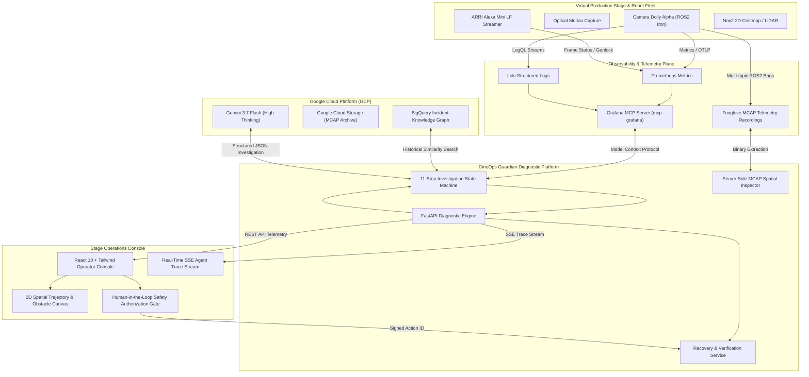

# CineOps Guardian 🎬🤖

<div align="center">

[](README.md)
[](README_KO.md)
[](README_ZH.md)

[](https://opensource.org/licenses/Apache-2.0)
[](https://www.python.org/downloads/)
[-cyan.svg)](https://deepmind.google/technologies/gemini/)
[](https://github.com/grafana/mcp-grafana)
[](https://mcap.dev/)
[](https://www.docker.com/)

**[ 🇺🇸 English ](README.md) | [ 🇰🇷 한국어 ](README_KO.md) | [ 🇨🇳 简体中文 ](README_ZH.md)**

> **AI-Powered Observability & Incident Recovery Agent for Virtual Production Stages and Robotic Camera Fleets.**  
> *Built for the Agentic Cinema Hackathon — Grafana Labs Partner Track.*

</div>

---

## 🌟 Executive Summary

In modern **Virtual Production (VP) LED Volumes** running Unreal Engine nDisplay, robotic camera platforms (dollies, jibs, pan-tilt heads) must maintain sub-millimeter tracking accuracy and sub-millisecond genlock synchronization. A single unrecorded hardware delta—such as a lens swap shifting optical nodal extrinsics—causes LiDAR point-cloud misalignment, phantom obstacle inflation in navigation costmaps, rapid dolly velocity oscillation, and dropped camera frames.

Stage downtime halts full cast and crew, costing **$20,000 to $50,000+ per hour**.

**CineOps Guardian** bridges physical robotics and cloud observability by combining:
1. **Official Grafana Model Context Protocol (MCP)** for Prometheus metrics, Loki logs, and alerts.
2. **Server-Side MCAP Spatial Inspector** for multi-channel Foxglove telemetry recordings (`/tf`, `/dolly/odom`, `/costmap/obstacles`, `/camera/status`).
3. **Google Cloud BigQuery Knowledge Graph** for historical incident matching.
4. **Gemini 3.7 Flash (High Thinking)** for structured root-cause reasoning and ranked hypotheses.
5. **Human-in-the-Loop Safety Interlocks** ensuring no automated motion without operator sign-off.
6. **Empirical Post-Recovery Verification** with automated telemetry re-testing.

---

## 🏗️ System Architecture



---

## ⚡ The 11-Step Investigation Lifecycle

Every incident progresses through an auditable, deterministic 11-step state machine:

```
[01. Alert Intake] ➡️ [02. Grafana Prometheus Query] ➡️ [03. Grafana Loki Log Search]
        ⬇️
[04. Gemini Hypothesis Formulation] ➡️ [05. Differential Hypothesis Testing]
        ⬇️
[06. BigQuery Historical Match] ➡️ [07. MCAP Spatial Inspection]
        ⬇️
[08. Production Impact Assessment] ➡️ [09. Safe Recovery Synthesis]
        ⬇️
[10. Human Safety Authorization Gate] ➡️ [11. Comprehensive Summary & Verification]
```

---

## 🚀 Quickstart Guide

### Prerequisites
- **Python 3.12+**
- **Node.js 20+** and `npm`

### Installation & Local Run

```bash
# 1. Clone the repository
git clone https://github.com/chquandogong/cineops-guardian.git
cd cineops-guardian

# 2. Install dependencies
make install

# 3. Start development server (backend + frontend)
make dev
```

Open **`http://localhost:5173`** (or `http://localhost:8080` for unified FastAPI production build).

### Automated Testing & Linting

```bash
# Run backend pytest suite (11 unit & integration tests)
make test

# Run ruff code formatting and lint checks
make lint

# Run end-to-end smoke tests against running server
./scripts/smoke_test.sh http://localhost:8080
```

---

## 🛠️ Dual-Mode Operation (`DEMO_MODE`)

CineOps Guardian supports seamless switching between offline hermetic development and live cloud integration via `.env`:

| Mode | Environment Variable | Characteristics |
|---|---|---|
| **Hermetic / Mock** | `DEMO_MODE=mock` | Zero-dependency, 100% deterministic local fixtures. Ideal for judging, testing, and offline demos. |
| **Live Cloud** | `DEMO_MODE=real` | Live calls to Grafana Cloud MCP (`mcp-grafana`), Gemini 3.7 Flash, Google Cloud BigQuery, and GCS. |

---

## 📚 Comprehensive Documentation

- 📐 [**System Architecture & Mathematical Foundation**](docs/ARCHITECTURE.md)
- 📊 [**Grafana MCP & Observability Integration Guide**](docs/GRAFANA_INTEGRATION.md)
- 🎬 [**Demo Runbook & 3-Minute Evaluation Walkthrough**](docs/DEMO_RUNBOOK.md)
- 🏆 [**Hackathon Submission & Compliance Details**](docs/HACKATHON_SUBMISSION.md)

---

## 🛡️ Safety & Compliance

- **Zero Robot Danger:** The agent has zero direct robot actuation APIs; recovery actions are restricted to configuration profiles and calibration snapshots.
- **100% Synthetic Telemetry:** Zero proprietary stage data, secret tokens, or customer media.
- **Open Source:** Licensed under the [Apache 2.0 License](LICENSE).
