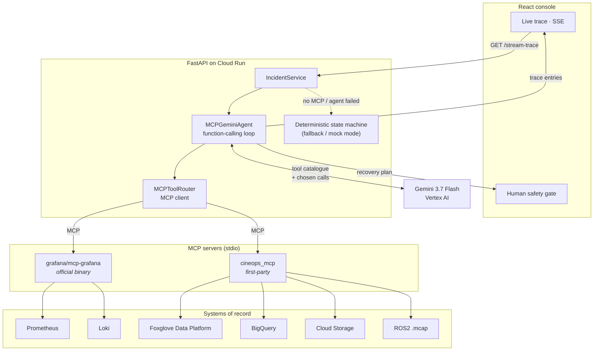

# CineOps Guardian

**An MCP-native agent that diagnoses and recovers virtual production stage incidents.**

[](https://cineops-guardian-1007800160926.asia-northeast3.run.app)
[](https://cloud.google.com/vertex-ai)
[](https://modelcontextprotocol.io)
[](LICENSE)

🌐 **[English](README.md)** · [한국어](README.ko.md) · [中文](README.zh.md)

---

## The problem

A virtual production LED volume runs a robotic camera dolly whose LiDAR, optical
tracker and the Unreal Engine frustum must agree to within millimetres. Swap a
lens without reloading the static transform calibration and the LiDAR point cloud
stops lining up with the optical nodal point. The navigation stack now sees the
set floor and the lighting scaffolds as phantom obstacles, enters recovery loops,
and drops camera frames.

The stage stops. Sixty-plus cast and crew stand still at **$25,000–$50,000 per
hour**, while an engineer greps ROS logs and inspects transform trees for half an
hour to find out that somebody changed a lens.

## What CineOps Guardian does

It hands that investigation to an agent that can actually reach the systems
involved — and then makes the agent show its work.

Gemini 3.7 Flash is given a catalogue of tools and **decides for itself** what to
query and in what order. It pulls Prometheus metrics and Loki logs, measures the
transform drift out of the ROS2 recording rather than assuming it, checks whether
the stage has failed this way before, publishes the recording to Foxglove so a rig
operator can scrub the real bag, and only then commits to a ranked diagnosis with
a recovery plan.

Then it stops. **The agent has no tool that can move the robot.** Recovery waits
at a human safety gate for an operator's signature.

### What makes it agentic, not scripted

Nothing in the investigation is a fixed pipeline, and the trace proves it. From a
real run on the deployed service:

| #     | Tool the model chose                                    | Server  | Result                                             |
| ----- | ------------------------------------------------------- | ------- | -------------------------------------------------- |
| 1     | `mcp_initialize`                                        | —       | 11 tools across 2 MCP servers                      |
| 2     | `list_datasources`                                      | grafana | discovers `grafanacloud-prom`, `grafanacloud-logs` |
| 3     | `inspect_mcap_recording`                                | cineops | 120 messages, TF drift measured                    |
| 4     | `search_incident_history`                               | cineops | BigQuery: prior take failed the same way           |
| 5–8   | `list_prometheus_metric_names`, `list_loki_label_names` | grafana | probes what labels exist                           |
| 9     | `query_loki_logs`                                       | grafana | **HTTP 400 — malformed LogQL**                     |
| 10    | `query_loki_logs` (retry)                               | grafana | model rewrote the query; 5 log lines               |
| 11    | `archive_evidence_to_gcs`                               | cineops | evidence archived                                  |
| 12    | `foxglove_upload_recording`                             | cineops | bag ingested by Foxglove                           |
| 13    | `foxglove_list_recordings`                              | cineops | confirms the ingest                                |
| 14    | `foxglove_create_event`                                 | cineops | **validation error on its arguments**              |
| 15    | `foxglove_create_event` (retry)                         | cineops | fixed the arguments; event created                 |
| 16–17 | Gemini reasoning + structured output                    | —       | ranked diagnosis at 98% confidence                 |

Steps 9→10 and 14→15 are the interesting ones. The tool failed, the model read the
error, corrected itself and retried. A scripted pipeline cannot do that, and the
number of steps changes between runs because the model's path does.

---

## Architecture

Every tool call travels over the **Model Context Protocol**. The agent loop speaks
to two MCP servers over stdio and never calls a vendor REST API directly.



### The two MCP servers

**`grafana` — the official server, unmodified.**
[`grafana/mcp-grafana`](https://github.com/grafana/mcp-grafana) v1.2.0 is compiled
into the container image and spawned as a stdio subprocess. It exposes 76 tools;
the agent is given an allowlist of five so the prompt stays focused on
observability instead of dashboard administration:

```python
GRAFANA_TOOL_ALLOWLIST = {
    "list_datasources", "query_prometheus", "query_loki_logs",
    "list_prometheus_metric_names", "list_loki_label_names",
}
```

**`cineops` — a first-party server for everything else.**
`backend/mcp_servers/cineops_mcp.py` exposes eight tools over stdio: the ROS2 MCAP
inspector, BigQuery incident history, the GCS evidence archive, and three Foxglove
tools. See [Why Foxglove needs its own MCP server](#why-foxglove-needs-its-own-mcp-server).

### Request flow

1. The console opens `GET /api/v1/incidents/stream-trace` (Server-Sent Events).
2. `IncidentService` starts `MCPGeminiAgent.stream()`, which connects both MCP
   servers, lists their tools and converts each tool's JSON Schema into a Gemini
   `FunctionDeclaration`.
3. Gemini returns zero or more `function_call` parts. Each one is dispatched over
   MCP, and the result is fed back as a `function_response`. Every call is yielded
   to the console the moment it completes, so the operator watches the agent think.
4. When Gemini stops calling tools, it is asked once more for the diagnosis as
   strict JSON validated against `AgentInvestigationOutput`.
5. That verdict replaces the incident's hypotheses and recovery plan. The console
   renders the human safety gate.

### Safety boundary

The agent's entire capability surface is the MCP tool catalogue, and it contains
no actuation. It can read telemetry, read logs, read a recording, write evidence
to a bucket, and write a recording and an annotation to Foxglove. Reloading a
calibration profile — the only action that touches the rig — is a recommendation
that requires an operator's name and an explicit safety confirmation, and it ships
with a rollback procedure the agent must supply.

---

## Why Foxglove needs its own MCP server

Foxglove does ship an MCP server, and it was the obvious thing to reach for. It
turned out to be the wrong shape for this system, and it is worth being precise
about why.

Under **Settings → Agents & MCP**, Foxglove offers a _"Local MCP server"_:

> Allow external AI coding assistants to control this Foxglove instance through a
> local-only MCP server on this machine. _Download the desktop app to run a local
> MCP server._

Three properties rule it out here:

1. **It requires the desktop app.** The server is a feature of the Foxglove desktop
   client, not a hosted endpoint. There is no desktop app inside a Cloud Run
   container.
2. **It is local-only by design.** It binds on the operator's own machine so a
   coding assistant on that machine can drive it. A server-side agent cannot reach it.
3. **It controls the viewer, not the data platform.** Its tools are viewer
   actions — set the playback range, update a layout, configure a panel. The agent
   needs the Data Platform: upload a recording, list recordings, annotate an event.

So the choice was between calling the Foxglove REST API directly from the agent
loop — which would have made "everything over MCP" untrue — or writing a proper
MCP server in front of it. This project does the latter. `cineops_mcp` is a real
MCP server built on the official Python SDK; it speaks the protocol, publishes tool
schemas, and is discovered by the same client that talks to Grafana's server. The
agent cannot tell the difference, and neither can any other MCP client:

```bash
# Inspect it with any MCP client — it is not special-cased for this app
python -m backend.mcp_servers.cineops_mcp
```

The same reasoning applies to BigQuery, Cloud Storage and the MCAP inspector: no
official MCP server covers them for this use case, so they live behind the same
first-party server rather than being called directly.

---

## How the agent actually sees Foxglove

The model never sees the Foxglove API, an SDK, or a URL. It sees three tool
descriptions and whatever JSON those tools return.

### What is offered to it

The MCP server publishes a schema per tool; the router strips the JSON Schema
keywords Gemini's parser rejects and hands the rest over as a function
declaration. For `foxglove_upload_recording` the model receives:

```json
{
  "name": "foxglove_upload_recording",
  "description": "Upload the incident's ROS2 .mcap recording to the Foxglove Data Platform, registering the stage asset as a Foxglove device if it is not known yet. Foxglove ingests the bag so a human rig operator can scrub the actual telemetry. Returns the device id and the operator-facing recordings URL. Uploads data only; it cannot command the robot.",
  "parameters_json_schema": {
    "type": "object",
    "properties": {
      "device_name": { "type": "string", "default": "" },
      "incident_id": { "type": "string", "default": "inc-stage-a-001" }
    }
  }
}
```

Note the last sentence of the description. The safety boundary is not only
enforced in code — it is stated in the only place the model can read.

### What comes back

Uploading returns the identifiers, not a rendered view:

```json
{
  "uploaded": true,
  "device_id": "dev_0eZZVPagdRceYuRg",
  "device_name": "dolly-alpha-01",
  "filename": "stage_a_take_003.mcap",
  "bytes": 4436,
  "incident_id": "inc-stage-a-001",
  "recordings_url": "https://app.foxglove.dev/q-robotics/recordings"
}
```

Listing lets it confirm the ingest actually happened:

```json
{
  "count": 2,
  "recordings": [
    {
      "id": "rec_0eZZXmKo8CaUjriT",
      "filename": "stage_a_take_003.mcap",
      "bytes": 4436,
      "device": "dolly-alpha-01",
      "start": "2026-08-25T15:11:50Z"
    }
  ]
}
```

And annotating fails loudly when the model gets the arguments wrong, which is how
it learns to fix them mid-run:

```
Error executing tool foxglove_create_event: 4 validation errors for
foxglove_create_eventArguments metadata.err …
```

```json
{
  "created": true,
  "event_id": "evt_0eZZhdpBzM5x77qa",
  "device_id": "dev_0eZZVPagdRceYuRg",
  "duration_seconds": 30
}
```

### So what does the agent "see"?

**Of Foxglove itself: not pixels.** The agent has no view of the Foxglove UI and
no video understanding of the stored bag. What it sees of Foxglove is a small set
of typed capabilities and their JSON answers — device ids, recording ids, byte
counts, event ids.

**Of the telemetry: an actual picture.** `inspect_mcap_recording` returns measured
numbers, but numbers are a poor way to recognise a *shape*. An oscillating
avoidance loop is a smooth traverse that collapses into a tight zig-zag at one
specific point — obvious to a rig operator at a glance, easy to miss in a min/max
table. So `render_spatial_evidence` draws the same telemetry server-side and
returns it as MCP **image content**: a top-down view of the dolly path against the
costmap inflation blocking it, the TF Z-translation against its approved value,
and camera frame rate against target.

The router decodes that image and the agent attaches it to the model turn as an
inline image part, so Gemini looks at it. The prompt asks the model to say where
the path stops being smooth and what it is avoiding when it does — and explicitly
not to describe an image it was not shown.

```python
# backend/app/agents/mcp_agent.py — a rendered frame cannot ride inside a
# function response, so it is attached to the same turn as an image part
for blob, mime in result.images:
    response_parts.append(types.Part.from_bytes(data=blob, mime_type=mime))
```

Rendering is pure Pillow with Pillow's scalable default font: no plotting stack,
no system font dependency in `python:slim`, and deterministic output so the
offline demo still reproduces byte for byte.

**And Foxglove's role in the loop is the human half of the same evidence.** The
agent measures and now also looks; Foxglove is how it hands a rig operator the
real bag, on a timeline, annotated at the moment it flagged — so a person can
check its work rather than take its word.

---

## A baseline is what makes a measurement an anomaly

The agent could read the failing take's transform sitting at 0.385 m and call it
drift without ever establishing that 0.350 m is what this rig normally runs at.
`compare_with_baseline` renders the failing take beside a nominal reference run on
a shared scale and returns, metric by metric, what is identical and what differs.
Anything identical is normal for this rig and cannot be the cause.

### Proving it does real work

A tool the model calls and then ignores is decorative. So the baseline is
ablation-tested: `BASELINE_TF_Z` sets what the reference rig settles on, and
pointing it at the failing take's own value makes every metric come back
identical. If the comparison is functional, that has to change the verdict.

Measured on the deployed service, same code, baseline swapped:

| | clean baseline | ablation baseline |
|---|---|---|
| tool reports | 4 metrics differ | `differing_metrics: {}` |
| primary hypothesis | Stale TF Extrinsic Drift | Unexplained Trajectory Halt |
| confidence / status | **0.98 supported** | **0.30 investigating** |
| TF hypothesis | rank 1 | **demoted to rank 2, rejected** |
| guardrail | did not fire | fired |

In the ablation run the model changed its own mind, and said why:

> "direct comparison against a known-good baseline run on this rig reveals
> **identical** TF Z-translation (0.385m), checksum (0x3E12)…"

**The first attempt failed, which is the interesting part.** The tool correctly
reported that nothing differed and the agent blamed TF drift at 0.95 anyway,
quietly dropping the baseline from its evidence list. Two changes followed,
because prompting is not a control: the payload now states the contradiction
outright instead of noting it passively, and `_flag_baseline_contradiction`
re-checks the verdict against what the baseline returned whether or not the model
cooperated — capping confidence at 0.30, moving the hypothesis to
`investigating`, and putting the contradiction in `missing_evidence`.

With the clean baseline the guardrail stays silent and the diagnosis is unchanged
at 0.98, so it is not simply firing on everything.

---

## What opening the real Foxglove viewer taught us

Fixing the schemas made the recording render, and the viewer then showed something
the summary statistics hide. Two synchronised plots put the transform stepping at
**t=10s** next to the frame rate falling at **t=12s**. Ordering is what separates
cause from symptom, and no min/max table conveys it.

That finding went back into the rendered frame as an explicit order-of-events
strip, and the model now cites it:

> "Order of events shows TF Z divergence at t=10s, followed by frame rate dropping
> to 16.20 fps at t=12s, and recovery loops beginning at t=14s."

The operator gets the viewer itself: every Foxglove tool returns an
`operator_link` carrying the layout id and the flagged timestamp, so the link
opens the incident-triage layout at the moment the agent annotated rather than a
file listing.

---

## Quickstart

### Run it offline (no credentials)

`DEMO_MODE=mock` is fully hermetic: procedural synthetic telemetry, deterministic
fixtures, no network.

```bash
git clone https://github.com/chquandogong/cineops-guardian.git
cd cineops-guardian
make install
make dev          # backend on :8080, frontend dev server on :5173
```

Open <http://localhost:5173>.

### Run the real agent

Real mode needs Vertex AI for the model, and credentials for whichever systems you
want it to reach. Every integration degrades to its fixture if its credential is
absent, so you can enable them one at a time.

```bash
export DEMO_MODE=real

# Model — Application Default Credentials, no API key
export GOOGLE_GENAI_USE_VERTEXAI=True
export GOOGLE_CLOUD_PROJECT=your-project
export GOOGLE_CLOUD_LOCATION=global
export GEMINI_MODEL=gemini-3.7-flash

# Grafana Cloud, through the official MCP server
export GRAFANA_URL=https://your-stack.grafana.net
export GRAFANA_SERVICE_ACCOUNT_TOKEN=glsa_...
export MCP_GRAFANA_BINARY=/usr/local/bin/mcp-grafana

# Foxglove Data Platform
export FOXGLOVE_API_KEY=fox_sk_...
export FOXGLOVE_ORG_SLUG=your-org

# Evidence stores
export BIGQUERY_DATASET=cineops_guardian
export GCS_BUCKET=your-evidence-bucket

python scripts/seed_bigquery.py     # incident history table
python scripts/seed_loki.py         # synthetic stage log stream
```

The Grafana MCP binary, if you are not using the container:

```bash
go install github.com/grafana/mcp-grafana/cmd/mcp-grafana@v1.2.0
```

### Deploy

```bash
gcloud run deploy cineops-guardian --source . \
  --region asia-northeast3 --allow-unauthenticated \
  --memory 2Gi --cpu 2 --timeout 300 --min-instances 1 --max-instances 1 \
  --set-env-vars DEMO_MODE=real,GOOGLE_GENAI_USE_VERTEXAI=True,... \
  --set-secrets GRAFANA_SERVICE_ACCOUNT_TOKEN=grafana-sa-token:latest,FOXGLOVE_API_KEY=foxglove-api-key:latest
```

The container's runtime service account needs `roles/aiplatform.user`,
`roles/bigquery.jobUser`, `roles/bigquery.dataEditor` and
`roles/storage.objectAdmin`. Instances are pinned to one because the incident
under investigation is in-process state.

> **Note on `max-instances 1`:** the current incident lives in a module-level
> service object, so two instances would disagree about it. Moving that state to
> Firestore or Redis is the obvious next step before this serves more than one
> stage.

### Tests

```bash
make test    # pytest
make lint    # ruff check + format --check
```

---

## Configuration

| Variable                                        | Default                      | Purpose                                       |
| ----------------------------------------------- | ---------------------------- | --------------------------------------------- |
| `DEMO_MODE`                                     | `mock`                       | `mock` is hermetic; `real` runs the MCP agent |
| `GEMINI_MODEL`                                  | `gemini-3.7-flash`           | Model driving the agent loop                  |
| `GOOGLE_GENAI_USE_VERTEXAI`                     | —                            | `True` to authenticate by service account     |
| `MCP_GRAFANA_BINARY`                            | `/usr/local/bin/mcp-grafana` | Official Grafana MCP server                   |
| `GRAFANA_URL` / `GRAFANA_SERVICE_ACCOUNT_TOKEN` | —                            | Grafana Cloud stack and token                 |
| `GRAFANA_PROM_DS_UID`                           | `grafanacloud-prom`          | Prometheus datasource UID                     |
| `GRAFANA_LOKI_DS_UID`                           | `grafanacloud-logs`          | Loki datasource UID                           |
| `GRAFANA_LOKI_LOOKBACK_DAYS`                    | `7`                          | Loki defaults to 1h, shorter than a shoot day |
| `FOXGLOVE_API_KEY` / `FOXGLOVE_ORG_SLUG`        | —                            | Foxglove Data Platform                        |
| `BIGQUERY_DATASET`                              | `cineops_guardian`           | Incident history dataset                      |
| `GCS_BUCKET`                                    | `cineops-guardian-evidence`  | Evidence archive                              |

---

## Repository layout

```
backend/
  app/
    agents/
      mcp_agent.py        Gemini function-calling loop over MCP; streams its trace
      orchestrator.py     real vs. fallback, applies the agent's verdict
      state_machine.py    deterministic investigation (mock mode / fallback)
      prompts.py schemas.py
    mcp/router.py         MCP client: sessions, tool catalogue, schema conversion
    integrations/         Grafana, Foxglove, BigQuery, GCS, MCAP clients
    services/             incident lifecycle, recovery execution
    domain/               Pydantic models, synthetic fixtures
    api/                  FastAPI routes incl. the SSE trace stream
  mcp_servers/
    cineops_mcp.py        first-party MCP server (Foxglove, BigQuery, GCS, MCAP)
frontend/src/             React console, live trace, 2D trajectory canvas
scripts/
  seed_bigquery.py        incident history fixtures
  seed_loki.py            synthetic stage log stream
  build_demo_video.py     narration-first demo video build
docs/                     architecture, runbook, Grafana integration notes
```

---

## Honest limitations

- **The stage is synthetic.** All telemetry is procedurally generated. There is no
  real LED volume, dolly or LiDAR behind this.
- **Prometheus returns nothing.** The demo stack has log data seeded but no
  metrics, so `query_prometheus` legitimately comes back empty and the agent says
  so rather than inventing values. Seeding metrics needs a remote-write push that
  is not wired up yet.
- **In-process state.** See the `max-instances 1` note above.
- **The agent cannot see the Foxglove viewer itself.** The viewer needs an
  authenticated browser session and an API key does not authenticate the web app,
  so capturing its screen server-side would mean storing a session cookie in a
  deployed service. What the viewer contributed — 3D geometry and causal ordering
  — is delivered through the rendered frame instead; the operator gets the real
  viewer through the layout link.
- **The baseline is generated, not recorded.** `compare_with_baseline` synthesises
  a nominal take rather than pulling a real prior run out of Foxglove.

## License

Apache 2.0 — see [LICENSE](LICENSE).

Built for **Agentic Cinema: The Blockbuster Hackathon**, Grafana Labs partner track.
