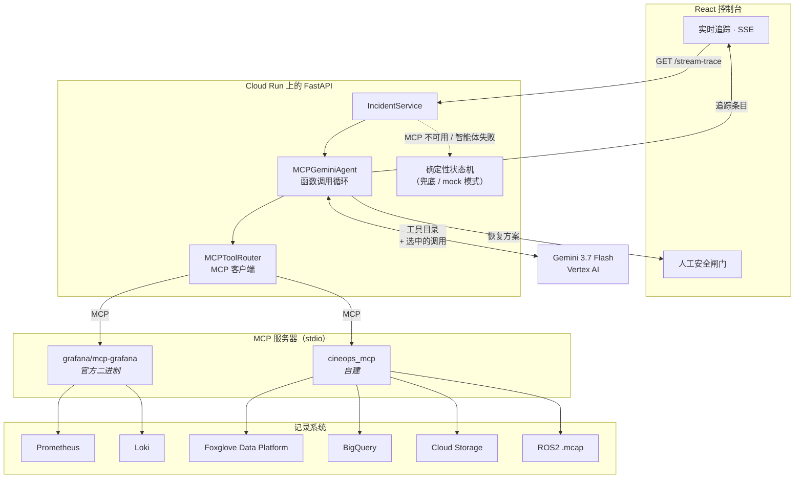

# CineOps Guardian

**一个以 MCP 为原生接口的智能体，用于诊断并恢复虚拟制片摄影棚故障。**

[](https://cineops-guardian-1007800160926.asia-northeast3.run.app)
[](https://cloud.google.com/vertex-ai)
[](https://modelcontextprotocol.io)
[](LICENSE)

🌐 [English](README.md) · [한국어](README.ko.md) · **[中文](README.zh.md)**

---

## 问题

在虚拟制片的 LED 摄影棚里，机械摄影车上的 LiDAR、光学追踪器和 Unreal Engine 的
视锥必须精确到毫米级一致。换一次镜头却没有重新加载静态变换（static transform）
标定，LiDAR 点云就会与光学节点对不上。于是导航栈把地面和灯光支架当成幽灵障碍物，
进入避障恢复循环，并开始丢帧。

摄影棚停摆。六十多位演员和工作人员原地等待，每小时烧掉 **$25,000 到 $50,000**，
而工程师要花半个小时 grep ROS 日志、翻查变换树，最后才发现：有人换了镜头。

## CineOps Guardian 做什么

它把这项排查交给一个**真正能触达相关系统**的智能体，并且强制这个智能体把自己的
推理过程完整暴露出来。

把工具目录交给 Gemini 3.7 Flash，查什么、按什么顺序查，都由**模型自己决定**。它
拉取 Prometheus 指标和 Loki 日志；变换漂移不靠猜，而是直接从 ROS2 录制中测量；
查询这个摄影棚过去是否以同样方式失败过；把录制上传到 Foxglove，好让机械臂操作员
能够回放真实的 bag。只有做完这些，它才给出带排序的诊断和恢复方案。

然后它停下。**智能体没有任何可以移动机器人的工具。** 恢复动作停在人工安全闸门，
等待操作员签字。

### 凭什么说这是智能体而不是脚本

排查过程中没有任何固定流水线，追踪日志就是证据。以下是部署服务上的一次真实运行：

| #     | 模型选择的工具                                          | 服务器  | 结果                                          |
| ----- | ------------------------------------------------------- | ------- | --------------------------------------------- |
| 1     | `mcp_initialize`                                        | —       | 2 个 MCP 服务器，共 11 个工具                 |
| 2     | `list_datasources`                                      | grafana | 发现 `grafanacloud-prom`、`grafanacloud-logs` |
| 3     | `inspect_mcap_recording`                                | cineops | 120 条消息，测出 TF 漂移                      |
| 4     | `search_incident_history`                               | cineops | BigQuery：过去某次拍摄同样失败                |
| 5–8   | `list_prometheus_metric_names`、`list_loki_label_names` | grafana | 探查存在哪些标签                              |
| 9     | `query_loki_logs`                                       | grafana | **HTTP 400 — LogQL 语法错误**                 |
| 10    | `query_loki_logs`（重试）                               | grafana | 模型改写了查询 → 取到 5 条日志                |
| 11    | `archive_evidence_to_gcs`                               | cineops | 证据归档                                      |
| 12    | `foxglove_upload_recording`                             | cineops | Foxglove 完成 bag 摄取                        |
| 13    | `foxglove_list_recordings`                              | cineops | 确认摄取成功                                  |
| 14    | `foxglove_create_event`                                 | cineops | **参数校验失败**                              |
| 15    | `foxglove_create_event`（重试）                         | cineops | 修正参数 → 事件创建成功                       |
| 16–17 | Gemini 推理 + 结构化输出                                | —       | 置信度 98% 的排序诊断                         |

关键在 9→10 和 14→15：工具失败了，模型读到错误，自行纠正并重试。脚本化的流水线做
不到这一点。而且因为模型每次走的路径不同，步骤数量本身每次都会变。

---

## 架构

所有工具调用都经由 **Model Context Protocol**。智能体循环通过 stdio 与两个 MCP
服务器通信，从不直接调用厂商的 REST API。



### 两个 MCP 服务器

**`grafana` — 官方服务器，未做修改。**
[`grafana/mcp-grafana`](https://github.com/grafana/mcp-grafana) v1.2.0 被编译进
容器镜像，并以 stdio 子进程方式启动。它暴露 76 个工具；我们只把 5 个放进白名单，
让提示词聚焦在可观测性上，而不是仪表盘管理：

```python
GRAFANA_TOOL_ALLOWLIST = {
    "list_datasources", "query_prometheus", "query_loki_logs",
    "list_prometheus_metric_names", "list_loki_label_names",
}
```

**`cineops` — 承担其余全部职责的自建服务器。**
`backend/mcp_servers/cineops_mcp.py` 通过 stdio 暴露 6 个工具：ROS2 MCAP 检查器、
BigQuery 故障历史、GCS 证据归档，以及 3 个 Foxglove 工具。原因详见
[为什么 Foxglove 需要自建 MCP 服务器](#为什么-foxglove-需要自建-mcp-服务器)。

### 请求流程

1. 控制台打开 `GET /api/v1/incidents/stream-trace`（Server-Sent Events）。
2. `IncidentService` 启动 `MCPGeminiAgent.stream()`：连接两个 MCP 服务器、列出其
   工具，并把每个工具的 JSON Schema 转换为 Gemini 的 `FunctionDeclaration`。
3. Gemini 返回零个或多个 `function_call`。每个调用经 MCP 分发，结果以
   `function_response` 回灌。每次调用一完成就推送给控制台，操作员因此能实时看到
   智能体的思考过程。
4. 当 Gemini 停止调用工具，再请求一次严格 JSON 形式的诊断，并用
   `AgentInvestigationOutput` 校验。
5. 这份结论替换故障的假设列表与恢复方案。控制台随即渲染人工安全闸门。

### 安全边界

智能体的能力范围就是这份 MCP 工具目录，而其中**不含任何驱动动作**。它能读遥测、
读日志、读录制、把证据写进存储桶、把录制和标注写进 Foxglove。唯一真正触及机械装置
的动作——重新加载标定配置——只是一条*建议*，需要操作员姓名和明确的安全确认，并且
必须附带由智能体自己给出的回滚步骤。

---

## 为什么 Foxglove 需要自建 MCP 服务器

Foxglove 确实提供 MCP 服务器，这也是我们最先去找的东西。结果发现它的形态不适合本
系统，值得把原因说清楚。

在 **Settings → Agents & MCP** 下，Foxglove 提供一个 _"Local MCP server"_：

> 允许外部 AI 编码助手通过本机上的仅限本地的 MCP 服务器控制此 Foxglove 实例。
> _下载桌面应用以运行本地 MCP 服务器。_

三个性质使它在这里不可用：

1. **它需要桌面应用。** 该服务器是 Foxglove 桌面客户端的功能，不是托管端点。
   Cloud Run 容器里没有桌面应用。
2. **它在设计上仅限本地。** 它绑定在操作员自己的机器上，供同一台机器上的编码助手
   驱动。服务端的智能体无法访问。
3. **它控制的是查看器，不是数据平台。** 它的工具是*查看器动作*——设置回放范围、
   更新布局、配置面板。智能体需要的是数据平台：上传录制、列出录制、标注事件。

于是只有两个选择：在智能体循环里直接调用 Foxglove REST API——那么"一切都经由
MCP"这句话就不成立了；或者在它前面写一个真正的 MCP 服务器。本项目选择了后者。
`cineops_mcp` 是用官方 Python SDK 构建的真实 MCP 服务器：它讲这个协议、发布工具
schema，并由那个同时连接 Grafana 服务器的客户端发现。智能体分辨不出两者的区别，
任何其他 MCP 客户端也一样。

```bash
# 可以用任意 MCP 客户端检视它 —— 它没有为本应用做特殊处理
python -m backend.mcp_servers.cineops_mcp
```

BigQuery、Cloud Storage 和 MCAP 检查器同理：没有官方 MCP 服务器覆盖这些用途，
所以它们也放在同一个自建服务器背后，而不是被直接调用。

---

## 智能体实际"看到"的 Foxglove 是什么

模型看不到 Foxglove 的 API、SDK 或 URL。它只看到三段工具描述，以及这些工具返回的
JSON。

### 提供给它的东西

MCP 服务器为每个工具发布 schema；路由层剔除 Gemini 解析器不接受的 JSON Schema
关键字，再作为函数声明交给模型。对 `foxglove_upload_recording`，模型收到的是：

```json
{
  "name": "foxglove_upload_recording",
  "description": "Upload the incident's ROS2 .mcap recording to the Foxglove Data Platform, registering the stage asset as a Foxglove device if it is not known yet. Foxglove ingests the bag so a human rig operator can scrub the actual telemetry. Returns the device id and the operator-facing recordings URL. Uploads data only; it cannot command the robot.",
  "parameters_json_schema": {
    "type": "object",
    "properties": {
      "device_name": { "type": "string", "default": "" },
      "incident_id": { "type": "string", "default": "inc-stage-a-001" }
    }
  }
}
```

注意描述的最后一句。安全边界不只在代码里强制，也写在模型唯一能读到的地方。

### 返回给它的东西

上传返回的是标识符，而不是渲染好的画面：

```json
{
  "uploaded": true,
  "device_id": "dev_0eZZVPagdRceYuRg",
  "device_name": "dolly-alpha-01",
  "filename": "stage_a_take_003.mcap",
  "bytes": 4436,
  "incident_id": "inc-stage-a-001",
  "recordings_url": "https://app.foxglove.dev/q-robotics/recordings"
}
```

列表查询让它能确认摄取确实发生了：

```json
{
  "count": 2,
  "recordings": [
    {
      "id": "rec_0eZZXmKo8CaUjriT",
      "filename": "stage_a_take_003.mcap",
      "bytes": 4436,
      "device": "dolly-alpha-01",
      "start": "2026-08-25T15:11:50Z"
    }
  ]
}
```

而标注在参数写错时会明确失败——这正是模型能在运行途中自我修正的原因：

```
Error executing tool foxglove_create_event: 4 validation errors for
foxglove_create_eventArguments metadata.err …
```

```json
{
  "created": true,
  "event_id": "evt_0eZZhdpBzM5x77qa",
  "device_id": "dev_0eZZVPagdRceYuRg",
  "duration_seconds": 30
}
```

### 那么智能体究竟"看到"了什么

**对 Foxglove 本身：不是像素。** 智能体看不到 Foxglove 的界面，也没有对已存 bag 的
视频理解能力。它关于 Foxglove 所看到的，只是一小组带类型的能力及其 JSON 应答——
设备 id、录制 id、字节数、事件 id。

**对遥测：是一张真实的图。** `inspect_mcap_recording` 返回实测数值，但数值不适合
用来辨认_形状_。避障震荡是一段平滑行进在某个具体位置塌缩成密集之字——机械臂操作员
一眼就能认出，在最大/最小值表里却很容易漏掉。因此 `render_spatial_evidence` 在服务
端把同样的遥测画出来，并作为 MCP **图像内容**返回：摄影车路径与阻挡它的代价地图
膨胀的俯视图、TF Z 平移与其批准值的对比、相机帧率与目标值的对比。

路由层解码这张图，智能体把它作为内联图像部分附加到模型的这一轮对话中，于是 Gemini
真的在看。提示词要求模型说出路径在哪里不再平滑、那时它在躲避什么，并明确要求
**不要描述没有给它看过的图像**。

```python
# backend/app/agents/mcp_agent.py —— 渲染帧无法塞进 function response，
# 因此作为图像部分附加到同一轮
for blob, mime in result.images:
    response_parts.append(types.Part.from_bytes(data=blob, mime_type=mime))
```

渲染使用纯 Pillow 与 Pillow 的可缩放默认字体：没有绘图栈，不依赖 `python:slim` 里
并不存在的系统字体，且输出是确定性的，因此离线演示仍能逐字节复现。

**而 Foxglove 在这个循环里的作用，是同一份证据面向人的另一半。** 智能体负责测量，
现在也会看；Foxglove 则是它把真实的 bag、时间线，以及在它标记那一刻打上的标注交到
机械臂操作员手里的方式——好让人能核对它的工作，而不是只能相信它。

---

## 快速开始

### 离线运行（无需凭据）

`DEMO_MODE=mock` 完全自包含：程序化生成的合成遥测、确定性 fixture、不联网。

```bash
git clone https://github.com/chquandogong/cineops-guardian.git
cd cineops-guardian
make install
make dev          # 后端 :8080，前端开发服务器 :5173
```

打开 <http://localhost:5173>。

### 运行真实智能体

real 模式需要 Vertex AI 提供模型，以及你希望它触达的各系统凭据。缺少凭据的集成会
各自降级为 fixture，因此可以逐个启用。

```bash
export DEMO_MODE=real

# 模型 —— Application Default Credentials，无需 API key
export GOOGLE_GENAI_USE_VERTEXAI=True
export GOOGLE_CLOUD_PROJECT=your-project
export GOOGLE_CLOUD_LOCATION=global
export GEMINI_MODEL=gemini-3.7-flash

# Grafana Cloud，经官方 MCP 服务器
export GRAFANA_URL=https://your-stack.grafana.net
export GRAFANA_SERVICE_ACCOUNT_TOKEN=glsa_...
export MCP_GRAFANA_BINARY=/usr/local/bin/mcp-grafana

# Foxglove Data Platform
export FOXGLOVE_API_KEY=fox_sk_...
export FOXGLOVE_ORG_SLUG=your-org

# 证据存储
export BIGQUERY_DATASET=cineops_guardian
export GCS_BUCKET=your-evidence-bucket

python scripts/seed_bigquery.py     # 故障历史表
python scripts/seed_loki.py         # 合成摄影棚日志流
```

若不使用容器，Grafana MCP 二进制：

```bash
go install github.com/grafana/mcp-grafana/cmd/mcp-grafana@v1.2.0
```

### 部署

```bash
gcloud run deploy cineops-guardian --source . \
  --region asia-northeast3 --allow-unauthenticated \
  --memory 2Gi --cpu 2 --timeout 300 --min-instances 1 --max-instances 1 \
  --set-env-vars DEMO_MODE=real,GOOGLE_GENAI_USE_VERTEXAI=True,... \
  --set-secrets GRAFANA_SERVICE_ACCOUNT_TOKEN=grafana-sa-token:latest,FOXGLOVE_API_KEY=foxglove-api-key:latest
```

容器的运行时服务账号需要 `roles/aiplatform.user`、`roles/bigquery.jobUser`、
`roles/bigquery.dataEditor` 和 `roles/storage.objectAdmin`。由于正在排查的故障是
进程内状态，实例数固定为 1。

> **关于 `max-instances 1`：** 当前故障存放在模块级服务对象里，两个实例会各说各话。
> 在服务多于一个摄影棚之前，把该状态迁到 Firestore 或 Redis 是显而易见的下一步。

### 测试

```bash
make test    # pytest
make lint    # ruff check + format --check
```

---

## 配置

| 变量                                            | 默认值                       | 用途                                    |
| ----------------------------------------------- | ---------------------------- | --------------------------------------- |
| `DEMO_MODE`                                     | `mock`                       | `mock` 为自包含；`real` 运行 MCP 智能体 |
| `GEMINI_MODEL`                                  | `gemini-3.7-flash`           | 驱动智能体循环的模型                    |
| `GOOGLE_GENAI_USE_VERTEXAI`                     | —                            | 使用服务账号认证时设为 `True`           |
| `MCP_GRAFANA_BINARY`                            | `/usr/local/bin/mcp-grafana` | 官方 Grafana MCP 服务器                 |
| `GRAFANA_URL` / `GRAFANA_SERVICE_ACCOUNT_TOKEN` | —                            | Grafana Cloud 实例与令牌                |
| `GRAFANA_PROM_DS_UID`                           | `grafanacloud-prom`          | Prometheus 数据源 UID                   |
| `GRAFANA_LOKI_DS_UID`                           | `grafanacloud-logs`          | Loki 数据源 UID                         |
| `GRAFANA_LOKI_LOOKBACK_DAYS`                    | `7`                          | Loki 默认 1 小时，短于一个拍摄日        |
| `FOXGLOVE_API_KEY` / `FOXGLOVE_ORG_SLUG`        | —                            | Foxglove Data Platform                  |
| `BIGQUERY_DATASET`                              | `cineops_guardian`           | 故障历史数据集                          |
| `GCS_BUCKET`                                    | `cineops-guardian-evidence`  | 证据归档                                |

---

## 仓库结构

```
backend/
  app/
    agents/
      mcp_agent.py        MCP 之上的 Gemini 函数调用循环，流式输出追踪
      orchestrator.py     real 与兜底切换，应用智能体结论
      state_machine.py    确定性排查（mock 模式 / 兜底）
      prompts.py schemas.py
    mcp/router.py         MCP 客户端：会话、工具目录、schema 转换
    integrations/         Grafana、Foxglove、BigQuery、GCS、MCAP 客户端
    services/             故障生命周期、恢复执行
    domain/               Pydantic 模型、合成 fixture
    api/                  FastAPI 路由，含 SSE 追踪流
  mcp_servers/
    cineops_mcp.py        自建 MCP 服务器（Foxglove、BigQuery、GCS、MCAP）
frontend/src/             React 控制台、实时追踪、2D 轨迹画布
scripts/
  seed_bigquery.py        故障历史 fixture
  seed_loki.py            合成摄影棚日志流
  build_demo_video.py     先配音后画面的演示视频构建
docs/                     架构、运行手册、Grafana 集成说明
```

---

## 诚实的局限

- **摄影棚是合成的。** 所有遥测都是程序化生成的。背后没有真实的 LED 摄影棚、
  摄影车或 LiDAR。
- **Prometheus 返回空结果。** 演示实例只灌入了日志、没有指标，所以
  `query_prometheus` 合理地返回空，而智能体会照实说明，不会编造数值。灌入指标需要
  remote-write 推送，目前尚未接通。
- **进程内状态。** 见上文 `max-instances 1` 的说明。
- **能标注但不能对比。** 它会上传和列出录制，但还不能把失败的这条拍摄与已知正常的
  一条做差异比对。

## 许可

Apache 2.0 —— 见 [LICENSE](LICENSE)。

为 **Agentic Cinema: The Blockbuster Hackathon** Grafana Labs 合作赛道打造。
