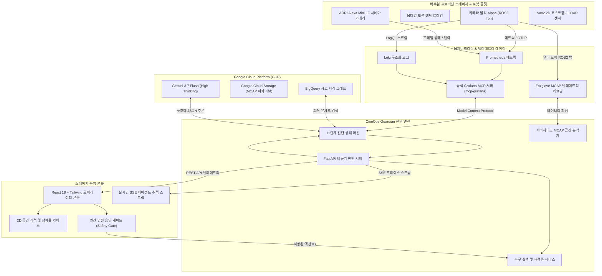

# CineOps Guardian 🎬🤖

<div align="center">

[](README.md)
[](README_KO.md)
[](README_ZH.md)

[](https://opensource.org/licenses/Apache-2.0)
[](https://www.python.org/downloads/)
[-cyan.svg)](https://deepmind.google/technologies/gemini/)
[](https://github.com/grafana/mcp-grafana)
[](https://mcap.dev/)
[](https://www.docker.com/)

**[ 🇺🇸 English ](README.md) | [ 🇰🇷 한국어 ](README_KO.md) | [ 🇨🇳 简体中文 ](README_ZH.md)**

> **가상 프로덕션(Virtual Production) 스테이지 및 로봇 카메라 플릿을 위한 AI 기반 관찰(Observability) 및 사고 복구 에이전트**  
> *Google Cloud & Grafana Labs — Agentic Cinema 해커톤 (Grafana Labs Partner Track 출품작)*

</div>

---

## 🌟 핵심 개요 (Executive Summary)

언리얼 엔진(Unreal Engine) nDisplay 기반의 최신 **버추얼 프로덕션(VP) LED 볼륨** 환경에서는 로봇 카메라 플랫폼(달리, 지브, 팬틸트 헤드)이 서브밀리미터(sub-millimeter) 단위의 공간 트래킹 정밀도와 서브밀리초(sub-millisecond) 단위의 젠락(Genlock) 동기화를 상시 유지해야 합니다. 

렌즈 교체 후 정적 좌표계 변환(Static Transform) 보정치를 갱신하지 않는 것과 같은 단순한 물리적 오차만으로도 LiDAR 포인트 클라우드 정렬이 틀어지고, 네비게이션 코스트맵에 "팬텀 장애물(유령 장애물)"이 생성되어 카메라 달리가 비상 회피 진동을 일으키거나 비디오 프레임 드롭이 발생합니다.

촬영 스테이지가 멈추면 60명 이상의 배우와 촬영 크루 전체가 대기 상태에 들어가며, **시간당 $20,000 ~ $50,000(한화 약 2,700만 ~ 6,700만 원) 이상의 막대한 다운타임 비용**이 발생합니다.

**CineOps Guardian**은 물리 로보틱스와 클라우드 옵저버빌리티를 결합하여 복합 장애를 60초 이내에 자동 진단하고 복구합니다:

1. **공식 Grafana Model Context Protocol (MCP):** Prometheus 메트릭, Loki 구조화 로그, 알림 규칙 연동.
2. **서버사이드 MCAP 공간 인스펙터:** ROS2 멀티 토픽 바이너리 레코딩(`/tf`, `/dolly/odom`, `/costmap/obstacles`, `/camera/status`) 분석.
3. **Google Cloud BigQuery 지식 그래프:** 과거 유사 사고(94% 일치도) 매칭 및 검증된 복구 절차 추천.
4. **Gemini 3.7 Flash (High Thinking):** 심층 사고(Thinking)를 통한 차등 가설 검증 및 네트워크/GPU 이상 배제.
5. **인간 안전 승인 인터록 (Human Safety Gate):** 오퍼레이터의 전자 서명 및 롤백 절차 확인 전까지 로봇 임의 구동을 원천 차단.
6. **실증적 복구 후 텔레메트리 재검증:** 4개 항목 텔레메트리 자동 재테스트를 통한 24.00 fps 젠락 복구 확인.

---

## 🏗️ 시스템 아키텍처 (System Architecture)



---

## ⚡ 11단계 진단 라이프사이클 (11-Step Lifecycle)

모든 사고는 감사 추적이 가능한 11단계 상태 머신을 거쳐 결정론적으로 처리됩니다:

```
[01. 사고 알림 수신] ➡️ [02. Grafana Prometheus 메트릭 쿼리] ➡️ [03. Grafana Loki 로그 검색]
        ⬇️
[04. Gemini 가설 수립] ➡️ [05. 차등 가설 실증 검증 (네트워크/GPU 배제)]
        ⬇️
[06. BigQuery 과거 사고 매칭] ➡️ [07. MCAP 공간 텔레메트리 정밀 분석]
        ⬇️
[08. 프로덕션 영향도 산출] ➡️ [09. 안전 복구 플랜 합성]
        ⬇️
[10. 인간 오퍼레이터 안전 승인 게이트] ➡️ [11. 4개 항목 자동 텔레메트리 재검증]
```

---

## 🚀 빠른 시작 가이드 (Quickstart)

### 사전 요구사항
- **Python 3.12 이상**
- **Node.js 20 이상** 및 `npm`

### 설치 및 로컬 실행

```bash
# 1. 저장소 클론
git clone https://github.com/chquandogong/cineops-guardian.git
cd cineops-guardian

# 2. 의존성 패키지 설치
make install

# 3. 개발 서버 실행 (FastAPI 백엔드 + Vite React 프론트엔드)
make dev
```

브라우저에서 **`http://localhost:5173`** (또는 통합 빌드 시 `http://localhost:8080`)에 접속합니다.

### 자동화 테스트 및 린트 검증

```bash
# 백엔드 pytest 스위트 실행 (11개 단위 및 통합 테스트)
make test

# ruff 코드 포매팅 및 린트 검사
make lint

# 실행 중인 서버 대상 E2E 스모크 테스트
./scripts/smoke_test.sh http://localhost:8080
```

---

## 🛠️ 이중 모드 지원 (`DEMO_MODE`)

CineOps Guardian은 `.env` 설정을 통해 오프라인 로컬 환경과 클라우드 실시간 연동을 완벽히 지원합니다:

| 모드 | 환경 변수 | 특징 |
|---|---|---|
| **Hermetic / Mock** | `DEMO_MODE=mock` | 외부 네트워크 의존성 0%, 100% 결정론적 로컬 픽스처. 오프라인 시연 및 심사 환경에 최적화. |
| **Live Cloud** | `DEMO_MODE=real` | Grafana Cloud MCP (`mcp-grafana`), Gemini 3.7 Flash, Google Cloud BigQuery, GCS 실시간 호출. |

---

## 📚 상세 기술 문서

- 📐 [**시스템 아키텍처 및 수학적 정식화 문서**](docs/ARCHITECTURE.md)
- 📊 [**Grafana MCP 및 옵저버빌리티 연동 가이드**](docs/GRAFANA_INTEGRATION.md)
- 🎬 [**3분 심사 시연 런북**](docs/DEMO_RUNBOOK.md)
- 🏆 [**해커톤 제출 내역서 및 규정 준수 보고서**](docs/HACKATHON_SUBMISSION.md)

---

## 🛡️ 안전성 및 라이선스

- **로봇 무단 구동 방지:** 에이전트에는 로봇 물리 액추에이터를 직접 조작하는 API가 일절 없으며, 복구는 설정 프로파일 및 보정치 스냅샷 리로드로 제한됩니다.
- **100% 합성 텔레메트리:** 독점 제작 자산, 고객 데이터, 비밀 토큰이 포함되지 않은 100% 순수 합성 픽스처로 구성되어 있습니다.
- **오픈소스 라이선스:** [Apache 2.0 License](LICENSE)에 따라 자유롭게 사용 및 검증이 가능합니다.
