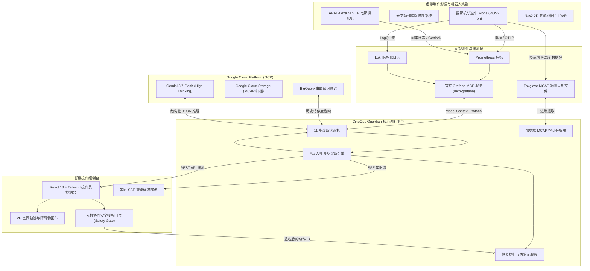

# CineOps Guardian 🎬🤖

<div align="center">

[](README.md)
[](README_KO.md)
[](README_ZH.md)

[](https://opensource.org/licenses/Apache-2.0)
[](https://www.python.org/downloads/)
[-cyan.svg)](https://deepmind.google/technologies/gemini/)
[](https://github.com/grafana/mcp-grafana)
[](https://mcap.dev/)
[](https://www.docker.com/)

**[ 🇺🇸 English ](README.md) | [ 🇰🇷 한국어 ](README_KO.md) | [ 🇨🇳 简体中文 ](README_ZH.md)**

> **面向虚拟制作摄影棚与机器人摄影机集群的 AI 可观测性与事故自动恢复智能体**  
> *专为 Google Cloud & Grafana Labs “Agentic Cinema” 黑客松（Grafana Labs 合作伙伴赛道）构建*

</div>

---

## 🌟 核心概述 (Executive Summary)

在基于虚幻引擎（Unreal Engine）nDisplay 的现代**虚拟制作（Virtual Production, VP）LED 影棚**中，机器人摄影机平台（轨道车、摇臂、云台）必须始终保持亚毫米级的空间跟踪精度与亚毫秒级的 Genlock 同步。

在拍摄现场，诸如更换镜头后未同步更新静态坐标变换（Static Transform）校准矩阵等细微物理变动，会导致激光雷达（LiDAR）点云与光学节点对齐失效，进而在导航代价地图（Costmap）中引发“幽灵障碍物膨胀”，导致摄影机轨道车进入紧急避障振荡循环并产生视频丢帧。

影棚停工会导致全剧组 60 多名演员与技术人员陷入停滞，每小时停工损失高达 **$20,000 至 $50,000 美元以上**。

**CineOps Guardian** 融合物理机器人技术与云端可观测性，能够在 60 秒内全自动诊断并恢复复杂的网络-物理系统故障：

1. **官方 Grafana 模型上下文协议 (MCP)：** 原生集成 Prometheus 指标、Loki 结构化日志及报警规则。
2. **服务端 MCAP 空间解析器：** 深度分析 ROS2 多话题二进制录制文件（`/tf`、`/dolly/odom`、`/costmap/obstacles`、`/camera/status`）。
3. **Google Cloud BigQuery 知识图谱：** 毫秒级匹配历史相似事故（相似度达 94%）并推荐经过验证的恢复方案。
4. **Gemini 3.7 Flash（High Thinking 深度思考）：** 进行结构化根因推理、多假设差异化测试，并自动排除网络抖动与 GPU 过热。
5. **人机协同安全联锁门禁 (Human Safety Gate)：** 严禁任何未经操作员电子签名确认的自主机器人物理运动。
6. **实证性恢复后遥测再验证：** 自动执行 4 项指标重测，确保静态变换校验和收敛并恢复 24.00 fps Genlock 锁相。

---

## 🏗️ 系统架构 (System Architecture)



---

## ⚡ 11 步诊断生命周期 (11-Step Lifecycle)

所有事故均通过可审计、确定性的 11 步状态机进行闭环处理：

```
[01. 事故告警接入] ➡️ [02. Grafana Prometheus 指标查询] ➡️ [03. Grafana Loki 日志检索]
        ⬇️
[04. Gemini 假设生成] ➡️ [05. 差异化假设测试 (排除网络/GPU异常)]
        ⬇️
[06. BigQuery 历史案例匹配] ➡️ [07. MCAP 空间遥测深度分析]
        ⬇️
[08. 拍摄影响评估] ➡️ [09. 安全恢复方案生成]
        ⬇️
[10. 操作员安全授权门禁] ➡️ [11. 4 点自动化遥测再验证]
```

---

## 🚀 快速上手指南 (Quickstart Guide)

### 前置要求
- **Python 3.12+**
- **Node.js 20+** 及 `npm`

### 安装与本地运行

```bash
# 1. 克隆代码仓库
git clone https://github.com/chquandogong/cineops-guardian.git
cd cineops-guardian

# 2. 安装依赖
make install

# 3. 启动开发服务器（FastAPI 后端 + Vite React 前端）
make dev
```

在浏览器中打开 **`http://localhost:5173`**（或生产环境构建的统一端口 `http://localhost:8080`）。

### 自动化测试与代码规范检查

```bash
# 运行后端 pytest 测试套件（包含 11 个单元与集成测试）
make test

# 运行 ruff 代码格式化与规范检查
make lint

# 针对运行中的服务执行端到端冒烟测试
./scripts/smoke_test.sh http://localhost:8080
```

---

## 🛠️ 双模式运行支持 (`DEMO_MODE`)

CineOps Guardian 支持通过 `.env` 配置文件在离线独立测试与云端实时集成之间无缝切换：

| 模式 | 环境变量 | 特性 |
|---|---|---|
| **Hermetic / Mock** | `DEMO_MODE=mock` | 零外部依赖，100% 确定性本地测试用例。非常适合离线评审、快速测试与演示。 |
| **Live Cloud** | `DEMO_MODE=real` | 实时连通 Grafana Cloud MCP (`mcp-grafana`)、Gemini 3.7 Flash、Google Cloud BigQuery 与 GCS。 |

---

## 📚 详细技术文档

- 📐 [**系统架构与数学理论基础文档**](docs/ARCHITECTURE.md)
- 📊 [**Grafana MCP 与可观测性集成指南**](docs/GRAFANA_INTEGRATION.md)
- 🎬 [**3 分钟评审演示操作手册**](docs/DEMO_RUNBOOK.md)
- 🏆 [**黑客松提交清单与合规性报告**](docs/HACKATHON_SUBMISSION.md)

---

## 🛡️ 安全性与合规性

- **零机器人失控风险：** 智能体完全不具备直接驱动机器人执行器的接口；恢复操作仅限于配置参数与静态校准快照的重载。
- **100% 合成遥测数据：** 所有遥测数据与测试包均为程序化合成，不包含任何商业机密、私有影视资产或密钥。
- **开源许可证：** 遵循 [Apache 2.0 许可证](LICENSE) 完全开源。
