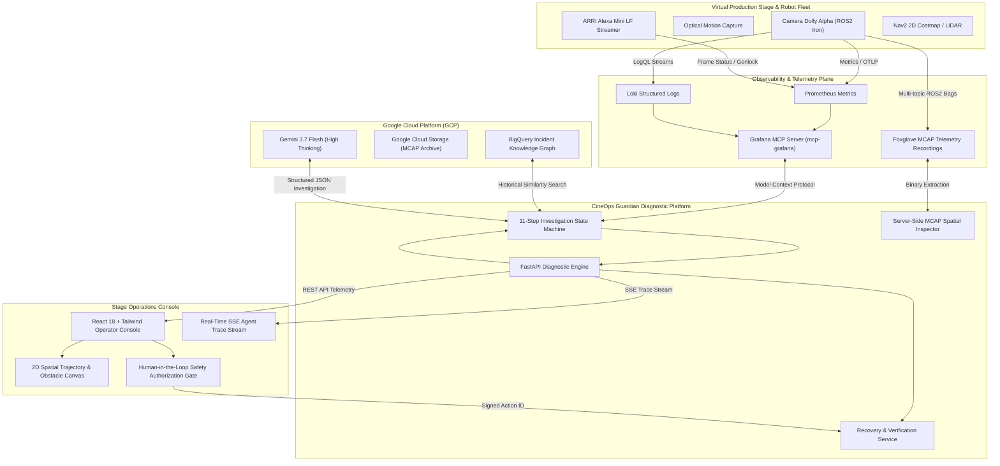

# CineOps Guardian — System Architecture & Technical Deep Dive

## 1. Executive Technical Overview

**CineOps Guardian** is an enterprise-grade AI observability and diagnostic platform engineered specifically for **Virtual Production (VP) LED stages** and **robotic camera systems** (e.g., motion-control dollies, robotic jibs, pan-tilt heads).

In modern virtual production environments (such as LED volumes running Unreal Engine nDisplay), robotic camera platforms must maintain sub-millimeter tracking accuracy and sub-millisecond genlock synchronization. A single miscalibration—such as an unrecorded lens nodal point offset—can trigger cascading failures across the sensor fusion and navigation stacks, causing avoidance oscillation, dropped camera frames, LED wall parallax tearing, and emergency stage shutdowns costing upwards of **$25,000 per hour** in crew downtime.

CineOps Guardian solves this by coupling **real-time Grafana observability (Prometheus + Loki via Model Context Protocol)**, **spatial ROS2/Foxglove MCAP telemetry inspection**, **BigQuery historical incident matching**, and **Gemini 3.7 Flash high-thinking reasoning** into a strictly safety-gated, deterministic investigation workflow.

---

## 2. High-Level System Architecture

---

## 3. The 11-Step Deterministic Investigation State Machine

CineOps Guardian implements an auditable, deterministic 11-step diagnostic state machine. Every tool interaction is captured with precise timestamps, duration, safe input parameters, and empirical output summaries.

| Step # | Stage Name | Tool / Component | Description & Objective |
|---|---|---|---|
| **01** | `incident_intake` | `alert_intake_webhook` | Ingests stage alert, creates incident record (`inc-stage-a-001`), captures active scene/take (`Scene 42 Take 3`). |
| **02** | `collect_grafana_context` | `mcp_grafana_query_prometheus` | Queries Grafana Prometheus via MCP for camera frame rate (`16.20 fps`), navigation retry count (`7`), and TF error norm (`0.038m`). |
| **03** | `collect_grafana_logs` | `mcp_grafana_query_loki` | Executes Loki LogQL search for static transform broadcaster CRC mismatches and costmap inflation warnings. |
| **04** | `form_hypotheses` | `gemini_hypothesis_formulation` | Gemini 3.7 Flash synthesizes candidate hypotheses spanning mechanical, RF/network, thermal, and calibration domains. |
| **05** | `test_hypotheses` | `gemini_differential_testing` | Tests candidate hypotheses against telemetry: rules out Private 5G packet loss (0.10%) and Jetson GPU thermals (62.5°C). |
| **06** | `query_historical_incidents` | `bigquery_historical_search` | Queries BigQuery historical database (`cineops_guardian.incident_history`) to find past resolution patterns. Matches `inc-stage-b-044` (94% similarity). |
| **07** | `inspect_recording_evidence` | `mcap_inspector_extract_tf_and_poses` | Parses raw MCAP telemetry file, extracts coordinate transform matrices from `/tf`, and detects +35mm Z-axis translation error. |
| **08** | `assess_production_impact` | `production_impact_evaluator` | Evaluates shooting schedule risk (Take 3 flagged, 18 min estimated delay, $25,000/hr burn rate). |
| **09** | `recommend_recovery` | `gemini_recovery_synthesis` | Synthesizes a safe, zero-actuation recovery plan: reload approved rig profile `CALIB-RIG-2026-v4` and recompute static transforms. |
| **10** | `request_human_approval` | `human_approval_gate` | Engages mandatory operator safety interlock in the console. Halts automated execution until explicit human sign-off. |
| **11** | `generate_incident_summary` | `incident_summary_generator` | Compiles comprehensive incident report with 2D trajectory visualization, metric charts, log stream, and Foxglove links. |

---

## 4. Mathematical & Sensor Fusion Domain Foundation

### 4.1. Coordinate Frame Transformations & Extrinsics Drift
In virtual production, the spatial relation between the dolly base LiDAR frame $F_{\text{lidar}}$ and the optical camera nodal center $F_{\text{optical}}$ is defined by a rigid-body transform $T_{\text{optical}}^{\text{lidar}} \in SE(3)$:

$$T_{\text{optical}}^{\text{lidar}} = \begin{bmatrix} R & \mathbf{t} \\ \mathbf{0}^T & 1 \end{bmatrix} \quad \text{where } R \in SO(3), \, \mathbf{t} = \begin{bmatrix} t_x \\ t_y \\ t_z \end{bmatrix} \in \mathbb{R}^3$$

When a camera technician swaps a lens (e.g. mounting a 35mm CinePrime on an extended bracket) without updating the active URDF calibration profile, the true physical translation vector shifts from $\mathbf{t}_{\text{approved}} = [0.120, 0.000, 0.350]^T$ to $\mathbf{t}_{\text{active}} = [0.120, 0.000, 0.385]^T$ ($\Delta z = +35\text{mm}$).

### 4.2. Nav2 Costmap Phantom Inflation & Velocity Oscillation
The 2D costmap projectively inflates obstacles within a clearance radius $r_{\text{inflation}}$:

$$C(x, y) = \exp\left(-\alpha \cdot (d(x, y) - r_{\text{robot}})\right)$$

Because the LiDAR point cloud is back-projected using the corrupted extrinsic matrix $T_{\text{optical}}^{\text{lidar}}$, stationary stage objects (such as Lighting C-Stand 03 at $x=4.82, y=2.15$) appear 35mm closer and displaced into the dolly's clearance envelope ($d = 1.25\text{m} < 1.50\text{m}$).

The DWB Local Planner detects a phantom obstacle collision on the planned trajectory, executing emergency avoidance subroutines (`SpinRecovery` and `BackupRecovery`). The resulting lateral velocity oscillation ($f_{\text{osc}} = 3.8\text{Hz}$) exceeds the camera's optical genlock compensation threshold, causing 32.5% frame drops ($16.20\text{ fps}$).

---

## 5. Multi-Channel Foxglove MCAP Telemetry

CineOps Guardian generates and inspects synchronized Foxglove-compatible `.mcap` recordings with standard JSON schema channels:

1. `/tf` — Real-time spatial transform tree (`lidar_link` $\rightarrow$ `camera_optical_frame`), translation vectors, and CRC checksums.
2. `/dolly/odom` — Pose ($x, y, \text{yaw}$), twist velocities ($v_x, \omega_z$), and recovery loop state flags.
3. `/costmap/obstacles` — Obstacle coordinates, clearance distance ($1.25\text{m}$), and inflation alert indicators.
4. `/camera/status` — Video frame delivery rate ($16.20\text{ fps}$ vs $24.00\text{ fps}$ target), genlock lock state, and dropped frame counts.

---

## 6. Safety & Human Oversight Guarantees

1. **Zero Autonomous Actuation:** The AI agent possesses zero write permissions to robot motor drives or motion controllers. It cannot initiate physical robot translation or rotation.
2. **Mandatory Operator Signature:** Recovery actions require the Stage Director / Lead Rig Operator to check safety conditions and sign off with their call sign.
3. **Deterministic Rollback:** Every recommendation includes an explicit rollback procedure (e.g., reverting to `CALIB-RIG-2026-v3` and manual e-stop).
4. **4-Point Telemetry Verification Checklist:** Post-action recovery is only marked `RESOLVED` after empirical verification:
   - Static TF CRC checksum matches `0x8F4A`.
   - Localization confidence $\ge 0.85$ (achieved $0.96$).
   - Navigation recovery loop count $= 0$.
   - Camera frame delivery rate $= 24.00\text{ fps}$ locked.
